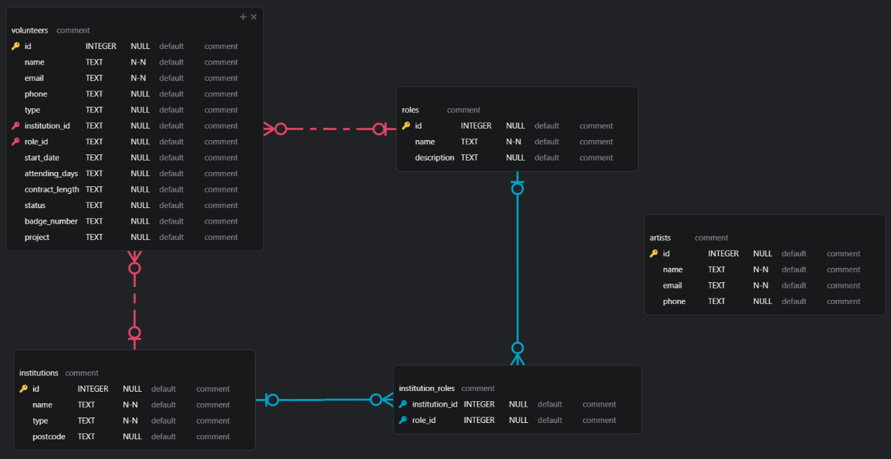

# Database Management System

---

## Overview

This is a project I completed as part of my role as a Junior Business Systems Developer at HARTS (Hospital Arts, Liverpool). My `Student-Planner` project was being developed simultaneously to this, so I chose to reuse Python and Tkinter for this project, improving my efficiency and the quality of work produced.

This application will connects to and manages an SQLite database storing administrative information, such as volunteers currently working for HARTS, universities offering placement opportunities through HARTS, roles available within the foundation, and information regarding artists HARTS sources from, reducing manual workload associated with managing this data.

You can track the project's progress [here](https://www.notion.so/1f918110f1f2805cadbcc1a2231c5f75?v=1f918110f1f2813da01c000cd25c6666&pvs=4)

## Entity Relationship Diagram



---

## What I've Learned

This project presented numerous challenges throughout all stages of development, offering valuable learning outcomes:
- **Planning & Collaboration**:The importance of efficient planning and collaboration with the stakeholders earlier on and establishing requirements would have avoided problems further down the line, like missing fields in the database.
- **SQLite**: This was also my first time using SQLite, although I have prior experience with MySQL, SQLite enabled me to utilise my SQL skills to develop and manage a relational database with a real-world purpose.
- **GitHub & Deployment**: Pre-releasing the application for internal testing and final deployment of my application gave me more exposure to GitHub's tools and improved my confidence using the platform, however, restrictions and security protocols within the NHS’ internal systems had to be resolved in order for the system to be downloadable for the intended members of staff, these are real-world issues I could face during my time in the industry.

---

## Note

This application was developed and deployed for internal use for HARTS (NHS, Liverpool), but if you wish to download this for personal use, an empty SQLite database is included.

---

## Features

- **Volunteer Management:** Add, view, edit, and delete volunteers, including details like name, contact info, type, institution, role, start date, attending days, contract length, and status.
- **Institution Management:** Manage universities and colleges, including their names, types, and postcodes.
- **Role Management:** Define roles and associate them with multiple institutions.
- **Artist Management:** Track artists with their names, emails, and phone numbers.
- **Filtering:** Filter volunteers by type, institutions by type, and roles by institution.
- **Data Integrity:** Enforces foreign key constraints to maintain relational integrity.
- **User-Friendly GUI:** Built with Tkinter and tkcalendar for date selection.
- **Data Input Validation** Currently being implemented.

---

## Technologies Used
- [Python 3.13.2](https://www.python.org/): Langauge used for GUI and application logic.
- [Visual Studio Code](https://code.visualstudio.com/): Primary IDE used throughout development.
- [SQLite 3](https://sqlite.org/): Used for storing and managing data for this application.
- [DB Browser for SQLite](https://sqlitebrowser.org/): Used for viewing the database's tables and data stored within them.

---

## Project Structure

### Key Files

- `gui.py`: All GUI-related code, sends necessary data to the logic layer.
- `logic.py`: Holds the connection to the database, handles core application logic and SQL queries.
- `database.db`: Locally stored SQLite databse holding all application data.

### Branches Overview

- `viewing-logic` (merged): Viewing functionality.
- `add-logic` (merged): Add functionality.
- `editing-logic` (merged): Editing functionality.
- `deleting-logic` (merged): Delete functionality.
- `validation-improvements` (merged): Input validation & error handling.
- `final-additions` (merged): Final improvements and corrections before deployment.

---

## Setup Instructions

### Prerequisites
- Python 3.12+
- pip (Python package manager)
- DB Browser for SQLite
- IDE of your choice

### Installation

#### Option 1 - Packaged Executable:

Download the latest executable file (`.exe`) displayed in the **Releases** tab.

**Note** Upon the first startup of the application, a new `database.db` file will be created, this file **must** remain within the same folder as the `.exe`, all data will be lost otherwise.

#### Option 2 - Source Code:

1. Clone the repository:

    ```
    git clone https://github.com/Mattytomo365/Database-Management-System.git
    ```

2. Navigate to the project directory:

    ```
    cd Database_Management_System
    ```

3. Install dependencies (a virtual environment is recommended):

    ```
    python -m venv venv
    .\venv\Scripts\activate (Windows)
    pip install -r requirements.txt
    ```

4. Run the application:

    ```
    python gui.py
    ```

### Usage

1. The database is automatically initialised, creating necessary tables if they don't already exist.
2. Use the main menu to access all primary features; viewing, adding, editing, or deleting.
3. Once a feature is selected, select the area of the database you would like to perform that operation on; volunteers, institutions, roles, or artists.
4. All changes are saved directly to the SQLite database.

---

## Contributing

**Contributions are welcome!**
Please fork the repository and submit a pull request with your changes.

---

## Contact

For any questions or feedback, feel free to reach out:

- **Email:** matty.tom@icloud.com
- **GitHub:** [Mattytomo365](https://github.com/Mattytomo365)
